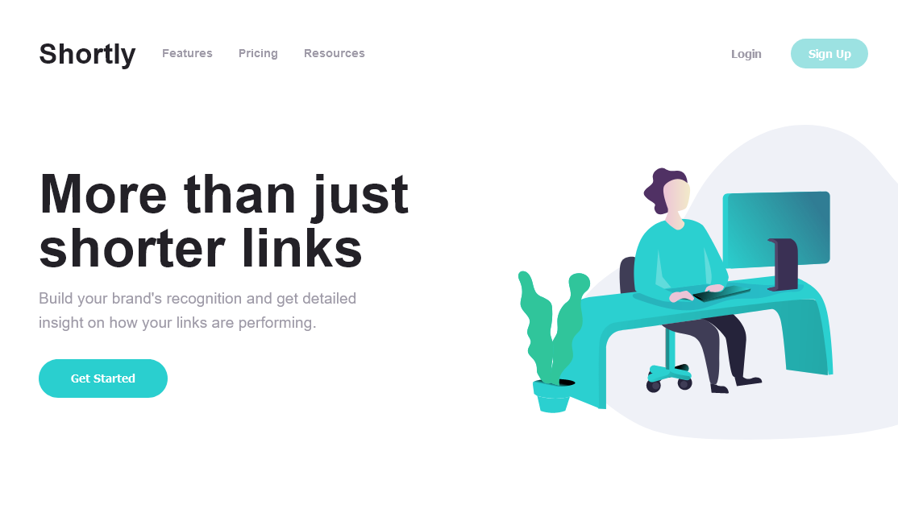

# Frontend Mentor - Shortly URL shortening API Challenge solution

This is a solution to the [Shortly URL shortening API Challenge challenge on Frontend Mentor](https://www.frontendmentor.io/challenges/url-shortening-api-landing-page-2ce3ob-G). Frontend Mentor challenges help you improve your coding skills by building realistic projects. 

### The challenge

Users should be able to:

- View the optimal layout for the site depending on their device's screen size
- Shorten any valid URL
- See a list of their shortened links, even after refreshing the browser
- Copy the shortened link to their clipboard in a single click
- Receive an error message when the `form` is submitted if:
  - The `input` field is empty

### Screenshot



### Built with

- Semantic HTML5 markup
- CSS custom properties
- Flexbox
- Typescript
- [React](https://reactjs.org/) - JS library

### What I learned
- How to use browser session storage.
- How to write to clipboard.

```js
window.onload = () => {
    if (typeof (Storage) !== "undefined" && sessionStorage.getItem('url_input') !== null) {
      setHistoryStyle('history-open');
      setCount(parseInt(sessionStorage.getItem("count")));
      setURL([sessionStorage.getItem('url_input'), sessionStorage.getItem("url_shorten"), sessionStorage.getItem("url_style")]);
      setURL1([sessionStorage.getItem("url1_input"), sessionStorage.getItem("url1_shorten"), sessionStorage.getItem("url1_style")]);
      setURL2([sessionStorage.getItem("url2_input"), sessionStorage.getItem("url2_shorten"), sessionStorage.getItem("url2_style")]);
    }
  }
```

### Useful resources

- [mdn web docs](https://developer.mozilla.org/en-US/docs/Web/API/Window/sessionStorage) - This gave me an overview on the sessionStorage property and how to manipulate it.

## Author
- Frontend Mentor - [Rodrick](https://www.frontendmentor.io/profile/Rodrick-alt)
